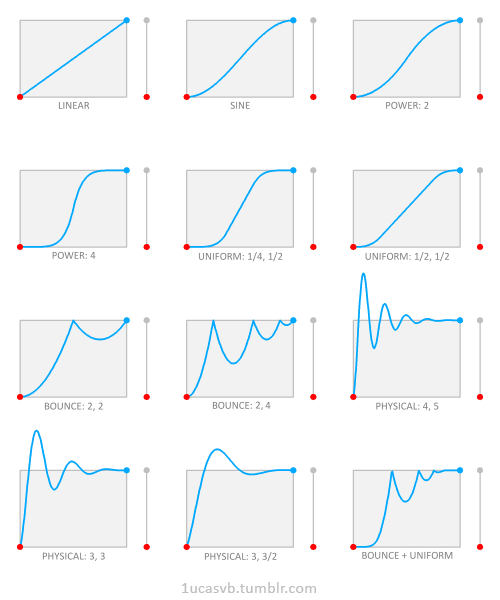
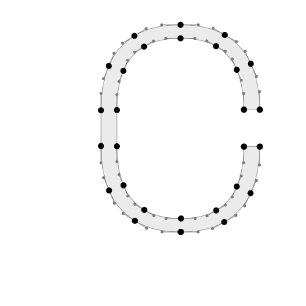

# Mouvement et Easing

Le mouvement en animation est la modification de la position, de la taille, de la forme ou d'autres attributs d'un élément graphique au fil du temps. Il est essentiel pour créer des interfaces dynamiques et des expériences utilisateur immersives.

L'easing est une technique qui permet de contrôler la vitesse et l'accélération d'un mouvement. En ajustant la vitesse, on peut créer des animations plus naturelles et plus attrayantes.

## Concepts clés

- **Interpolation**: Processus consistant à calculer une valeur intermédiaire entre deux valeurs connues. En animation, on interpole les positions, les couleurs, etc., pour créer des transitions fluides.
- **Fonction d'easing**: Une fonction mathématique qui modifie la courbe d'interpolation, permettant ainsi de contrôler la vitesse du mouvement. ([link](https://github.com/AndrewRayCode/easing-utils/blob/master/src/easing.js))
- **Courbe d'easing**: La représentation graphique d'une fonction d'easing. Elle visualise comment la valeur interpolée évolue au cours du temps. ([link](https://andrewraycode.github.io/easing-utils/gh-pages/))
- **Types de mouvements**:

  - **Linéaire**: Le mouvement se produit à une vitesse constante.
  - **Accéléré**: Le mouvement commence lentement et s'accélère progressivement.
  - **Décéléré**: Le mouvement commence rapidement et ralentit progressivement.
  - **Accéléré-décéléré**: Le mouvement commence et finit lentement, avec une phase d'accélération au milieu.
  - **Rebond**: Le mouvement dépasse sa cible et revient légèrement en arrière avant de se stabiliser.

    

## Animation de formes et de points

**FrameCount : le battement du cœur de l'animation**

- C'est une variable qui incrémente à chaque nouvelle image affichée, agissant comme un compteur de temps.
- En utilisant frameCount dans les calculs, on peut créer des mouvements cycliques, des pulsations, des oscillations, etc.
- Exemple: Pour faire grandir et rétrécir un cercle, on peut modifier son rayon en fonction d'une fonction sinusoïdale de frameCount.
- Exemple: Pour déplacer une forme d'un point A à un point B, on calcule à chaque frame une nouvelle position en interpolant entre A et B.

  

## Fonctions d'easing

**Le rôle des fonctions d'easing**

- Les fonctions d'easing permettent de modifier la vitesse d'une interpolation, créant ainsi des mouvements plus naturels et dynamiques.
- Elles définissent comment une valeur varie au cours du temps, en partant d'une valeur initiale pour atteindre une valeur finale.

## Applications

**Créations d'animations fluides et naturelles**

- **Interfaces utilisateurs**: Transitions d'éléments, animations de menus, effets de scroll, etc.
- **Jeux vidéo**: Mouvements des personnages, effets spéciaux, cinématiques.
- **Visualisations de données**: Animations de graphiques, de cartes, etc.

Simulations de mouvements physiques

- **Physique des particules**: Simulation de particules qui interagissent entre elles (feu, fumée, etc.).
- **Physique des solides**: Simulation de la chute d'objets, des collisions, etc.
- **Dynamique des fluides**: Simulation de l'écoulement de l'eau, de l'air, etc.

  
