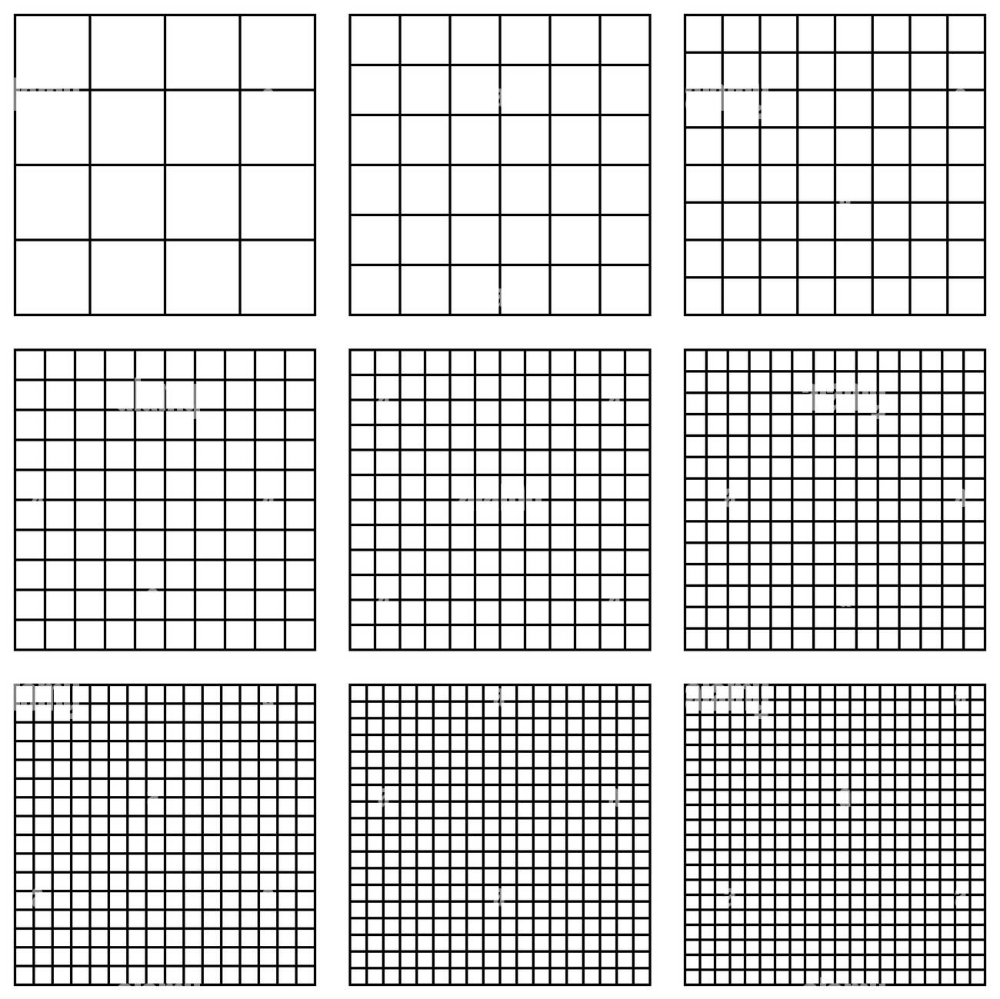

# Analyse des Pixels et Raster

Une image numérique est en réalité une grille de petits carrés colorés appelés pixels. Chaque pixel possède une couleur spécifique, définie par ses composantes rouge, verte et bleue (RVB). La résolution d'une image correspond au nombre de pixels qui la composent horizontalement et verticalement.

## La grille comme base de l'image numérique

Dans le contexte de l'analyse des pixels et des images raster, la notion de grille revêt une importance primordiale. Elle est le socle sur lequel repose la représentation numérique d'une image.

Une image numérique, c'est quoi ? C'est une matrice de pixels, c'est-à-dire une grille régulière de points colorés. Chaque point de cette grille correspond à un pixel, et la couleur de ce pixel est définie par ses composantes RVB (Rouge, Vert, Bleu).

**Pourquoi une grille ?**

- **Organisation**: La grille offre une structure ordonnée pour organiser tous les pixels de l'image.
- **Adresse unique**: Chaque pixel peut être identifié par ses coordonnées (ligne, colonne) dans la grille, ce qui facilite son accès et sa manipulation.
- **Calculs**: La grille permet de réaliser des calculs sur les pixels voisins, ce qui est essentiel pour de nombreuses opérations de traitement d'image (filtrage, détection de contours, etc.).

  

## Applications de la notion de grille en traitement d'images

- **Manipulation pixel par pixel**:
  - Modification de la couleur: En accédant à chaque pixel individuellement, on peut modifier sa couleur, sa luminosité, son contraste.
  - Application de filtres: Les filtres (flou, netteté, etc.) sont souvent implémentés en parcourant la grille de pixels et en appliquant des calculs sur les pixels voisins.
- **Segmentation d'image**: La grille permet de diviser l'image en régions homogènes, en analysant les propriétés des pixels dans des zones locales.
- **Compression d'image**: Les algorithmes de compression d'image exploitent la corrélation entre les pixels voisins pour réduire la taille du fichier image.
- **Reconnaissance de formes**: La grille est utilisée pour représenter les formes présentes dans une image et les comparer à des modèles connus.

## Modification des pixels

- **Accès individuel**: Chaque pixel peut être accédé individuellement pour en modifier la couleur.
- **Opérations basiques**:
  - **Luminosité**: En modifiant la valeur des composantes RVB de manière uniforme, on peut éclaircir ou assombrir une image.
  - **Contraste**: En augmentant ou en diminuant la différence entre les valeurs les plus claires et les plus sombres, on peut augmenter ou diminuer le contraste.
  - **Saturation**: En modifiant la pureté des couleurs, on peut rendre une image plus ou moins saturée.
- **Exercices pratiques**

  - Création d'effets visuels basé sur l’analyse de pixels statiques ou dynamiques

    
