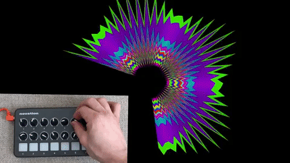

# Contrôleurs Externes

Le creative coding ne se limite pas à l'écran. L'interaction avec le monde physique est aussi une option. Les contrôleurs externes permettent de connecter votre code à des objets du monde réel, tels que des instruments de musique, des capteurs, des caméras, etc., créant ainsi des interfaces physiques intuitives et parfois plus pratiques suivant les usages.

## MIDI : Le protocole de la musique

Qu'est-ce que le MIDI ? Le Musical Instrument Digital Interface est un protocole de communication standard utilisé pour connecter et synchroniser des instruments de musique électroniques, des ordinateurs et d'autres appareils de musique.

- **Périphériques MIDI**: Claviers, pads, pédales, interfaces audio, etc….
- **Utilisation en creative coding**: Contrôler des paramètres audio, visuels ou autres dans votre code à l'aide d'instruments de musique:

  - **Mapping des notes MIDI**: Associer chaque note MIDI à une action spécifique dans votre code (changer une couleur, déclencher un son, etc.).
  - **Utilisation de la vélocité**: Utiliser la force avec laquelle une touche est pressée pour contrôler différents paramètres.
  - **Contrôle en temps réel**: Réagir instantanément aux changements de notes ou de vélocité.

    

## Boutons, capteurs

- **Types de capteurs**: Potentiomètres, capteurs de lumière, capteurs de mouvement, capteurs de température, etc.
- **Utilisation**: Créer des interfaces physiques personnalisées pour contrôler votre code.
- **Exemples**: Un potentiomètre pour contrôler la taille d'une forme, un capteur de lumière pour modifier la couleur d'un fond, etc.

## Caméra

- **Capture vidéo en temps réel**: Utiliser la webcam de votre ordinateur ou une caméra externe.
- **Traitement d'images**:

  - **Détection de mouvements**: Identifier les zones en mouvement dans une image.
  - **Reconnaissance de formes**: Identifier des formes spécifiques dans une image.
  - **Tracking d'objets**: Suivre un objet en mouvement.

    
