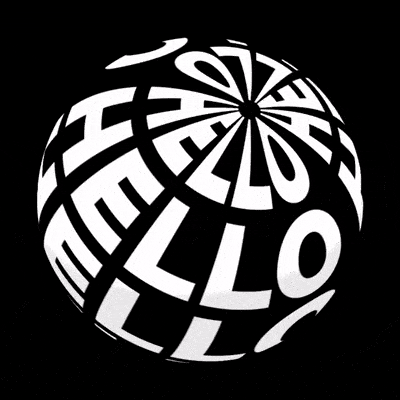

# 3D

L'utilisation de la 3D en JavaScript, notamment grâce à des bibliothèques comme Three.js, a révolutionné le monde du creative coding. Elle offre des possibilités infinies pour créer des expériences visuelles immersives et interactives.

## Les fondamentaux

- **La scène**: C'est le conteneur principal où tous les éléments 3D sont placés.
- **La caméra**: Elle définit le point de vue de l'observateur.
- **Les objets 3D**: Ce sont les éléments visibles dans la scène (cubes, sphères, modèles complexes).
- **Les matériaux**: Ils définissent l'apparence des objets (couleur, texture, brillance).
- **Les lumières**: Elles éclairent la scène et donnent du réalisme aux objets.
- **Le renderer**: C'est le processus qui affiche la scène à l'écran.

## Créer une scène simple

- **Initialiser Three.js**: Inclure la bibliothèque Three.js dans votre projet.
- **Créer une scène, une caméra et un rendu**: Instancier ces objets et les configurer.
- **Ajouter un objet 3D**: Créer une géométrie (par exemple, un cube) et un matériau, puis les associer à un mesh.
- **Afficher la scène**: Ajouter le rendu à votre document HTML.

## Contrôler les éléments

- **Géométries**: Apprendre à créer des formes simples, à importer des modèles 3D.
- Matériaux: Explorer les différents types de matériaux et leurs propriétés.
- **Lumières**: Comprendre les différents types de lumières et leurs effets sur la scène.
- **L’animation**: Gestion de l’interpolation dans l’espace
- **L’interaction**: Permettre à l'utilisateur d'interagir avec votre scène
- **Raycasting**: Détecter les intersections entre un rayon et les objets de la scène pour simuler des clics sur des objets.
- **Contrôles orbitaux**: Permettre à l'utilisateur de faire tourner la caméra autour d'un point central pour explorer la scène sous différents angles.

  
