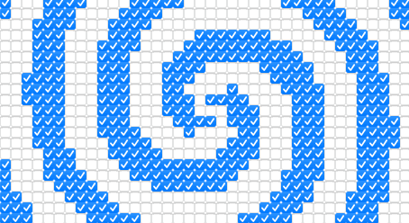

# DOM ET SVG

- **Qu'est-ce que le DOM ?**
  - Le Document Object Model : une représentation arborescente d'un document HTML.
  - **Les différents types de nœuds** : éléments, attributs, texte.
- **Qu'est-ce que le SVG ?**

  - Scalable Vector Graphics : un format graphique vectoriel pour la création d'images 2D.
  - Intégration du SVG dans le DOM.

    

### Manipulation du DOM

- **Accès aux éléments**:

  - getElementById, getElementsByTagName, querySelector, querySelectorAll.

- **Modification du contenu**:

  - textContent, innerHTML.
  - Modification des styles:
  - style, classList.

- **Création et suppression d'éléments**:

  - createElement, appendChild, removeChild.

- **Événements**:

  - addEventListener, removeEventListener.
  - Les différents types d'événements (clic, survol, etc.).

    

### Introduction au SVG

- **Les éléments SVG de base**:

  - svg, path, circle, rect, ellipse, line, polygon, polyline.

- **Les attributs SVG**:

  - cx, cy, r, x, y, width, height, d (pour les chemins).

- **Les styles CSS pour le SVG**:

  - fill, stroke, stroke-width, etc.

- **Intégration du SVG dans le DOM**:

  - Insertion d'un élément SVG dans un élément HTML.
  - Manipulation du SVG via le DOM et Javascript.

### Animation avec le DOM et SVG

- **Animation CSS**:
  - transition, animation.
- **Animation JavaScript**:
  - Modification des propriétés CSS à l'aide de JavaScript.
